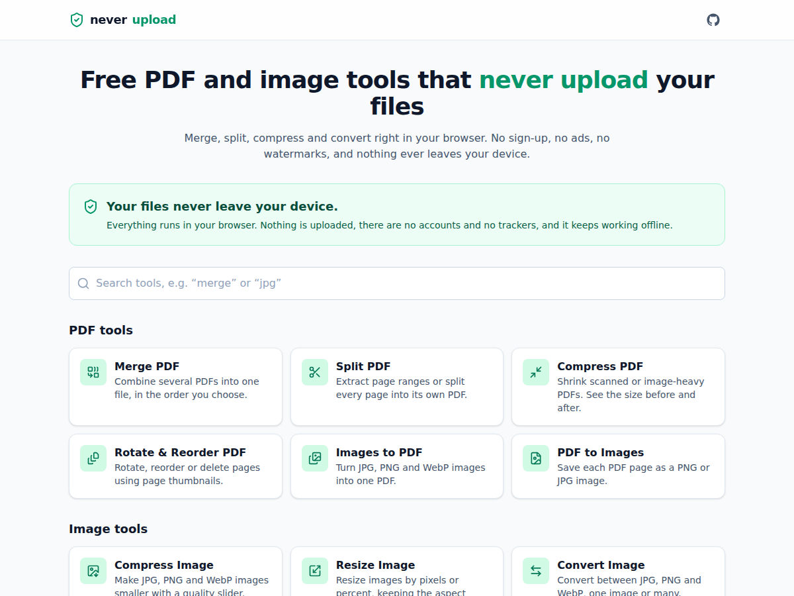

<div align="center">

# neverupload

**Free PDF and image tools that run 100% in your browser. Your files never leave your device.**

[Live demo](https://99proteam.github.io/neverupload/) · [Report a bug](https://github.com/99proteam/neverupload/issues/new?template=bug_report.yml) · [Request a tool](https://github.com/99proteam/neverupload/issues/new?template=tool_request.yml) · [Buy me a coffee](https://buymeacoffee.com/99proteam)

<!-- Screenshot: replace docs/screenshot-light.png with a newer capture whenever the UI changes. -->


</div>

## Tools

| Tool                     | What it does                                                                    |
| ------------------------ | ------------------------------------------------------------------------------- |
| **Merge PDF**            | Combine several PDFs into one; drag to set the order.                           |
| **Split PDF**            | Extract page ranges like `1-3, 5, 8-10`, or split every page (zip download).    |
| **Compress PDF**         | Re-render pages as JPEG at the quality and resolution you choose; before/after. |
| **Rotate & Reorder PDF** | Rotate, reorder and delete pages using thumbnails.                              |
| **Images to PDF**        | JPG, PNG and WebP to one PDF: A4, Letter or fit-to-image pages.                 |
| **PDF to Images**        | Each page to PNG or JPG at 72/150/300 DPI (zip download).                       |
| **Compress Image**       | Quality slider with a live size preview; batch support.                         |
| **Resize Image**         | By pixels or percent, keeping the aspect ratio; batch support.                  |
| **Convert Image**        | Between JPG, PNG and WebP; batch support.                                       |
| **QR Code Generator**    | Text or URL to PNG or SVG. No redirects, no tracking, no expiry.                |

Every tool has drag and drop, a progress bar, clear error messages, one-click download and a
"Process another" button. Everything works offline once the app has loaded, and it can be
installed as an app (PWA).

## Why no uploads?

Most "free online PDF tools" upload your files to someone else's server. Those files are often
contracts, IDs, bank statements and medical records. You have to trust a company you don't know
with them, and you have to wait for large uploads and downloads.

neverupload does everything **on your own device**:

- **No server receives your files.** It's a static website: HTML, JavaScript and CSS. Processing
  uses your browser's own engines (pdf-lib, pdf.js, Canvas) inside Web Workers.
- **Enforced by the browser.** The production build ships a Content Security Policy with
  `connect-src 'self'`, so the page _cannot_ send data to any other server, even by mistake.
- **No accounts, no analytics, no trackers, no ads, no cookies.**
- **Works offline.** After the first visit a service worker caches the app. Turn on airplane
  mode and it still works. That's the easiest way to check the claim yourself.
- **Open source.** Read the code, or build and host it yourself.

## Run locally

Requirements: Node.js 22 or newer.

```bash
git clone https://github.com/99proteam/neverupload.git
cd neverupload
npm install
npm run dev        # http://localhost:5173
```

Other scripts:

| Command             | Description                                           |
| ------------------- | ----------------------------------------------------- |
| `npm test`          | Unit tests (Vitest) for every processing function     |
| `npm run lint`      | ESLint + Prettier check                               |
| `npm run format`    | Format all files with Prettier                        |
| `npm run typecheck` | Strict TypeScript check                               |
| `npm run build`     | Production build into `dist/`                         |
| `npm run preview`   | Serve the production build locally                    |
| `npm run fixtures`  | Regenerate the small sample files in `tests/fixtures` |

## Self-host

It's just static files, so any web server or static host works (Nginx, Apache, Caddy, Netlify,
Cloudflare Pages, S3, an intranet share...).

```bash
npm ci
npm run build                          # served from the domain root "/"
# or, to serve from a sub-folder such as https://example.com/tools/
BASE_PATH=/tools/ SITE_URL=https://example.com/tools npm run build
```

Then copy the `dist/` folder to your server. `BASE_PATH` is the path the app is served from, and
`SITE_URL` is used for canonical links and `sitemap.xml`. Each tool has its own pre-rendered
`dist/<tool>/index.html`, so deep links work even without server-side rewrites. No environment
secrets, database or backend are needed.

### GitHub Pages

The included workflow (`.github/workflows/deploy.yml`) lints, tests and builds every push to
`main`, then publishes `dist/` to the `gh-pages` branch. GitHub Pages serves that branch at
`https://<user>.github.io/<repo>/`. If Pages isn't on yet in your fork, open
**Settings → Pages** and choose **Deploy from a branch → `gh-pages` / root**.

## SEO

Every page is pre-rendered at build time, so search engines and link previews get real content
without running JavaScript:

- **23 indexable pages:** 10 tools plus keyword landing pages such as `/jpg-to-pdf/`,
  `/pdf-to-jpg/`, `/webp-to-jpg/` and `/compress-pdf-for-email/` (defined in
  `src/tools/landing.ts`; each opens the right tool with the right preset).
- **Per-page tags:** title, description, keywords, canonical, `hreflang`, robots, Open Graph and
  Twitter cards with a 1200×630 preview image (`public/og/`, regenerate with
  `CHROME=/path/to/chrome node scripts/generate-og-images.mjs`).
- **Structured data (JSON-LD):** Organization, WebSite, WebApplication, BreadcrumbList, HowTo
  and FAQPage.
- **Crawlable content:** intro, "How to use" steps, FAQ, and internal links between related
  tools and conversions, plus links to every page in the footer.
- **`sitemap.xml`, `robots.txt` and `llms.txt`** (a summary for AI search assistants).

**Get indexed faster:** add the site in [Google Search Console](https://search.google.com/search-console)
and [Bing Webmaster Tools](https://www.bing.com/webmasters) using the "URL prefix" property
`https://99proteam.github.io/neverupload/`, verify with the **HTML tag** method, and submit
`sitemap.xml`. To add the verification tag, create repository variables
(**Settings → Secrets and variables → Actions → Variables**) named `GOOGLE_SITE_VERIFICATION`,
`BING_SITE_VERIFICATION` or `YANDEX_SITE_VERIFICATION` containing just the code; the next deploy
adds the matching `<meta>` tag.

## Project structure

```
src/
  components/        Shared UI: layout, drop zone, progress bar, result panel...
  hooks/             useJob (idle → working → done/error), drag-reorder, ...
  lib/               Shared helpers: zip, formats, pdf.js rendering, image codec
  workers/           Web Workers (pdf-lib jobs, OffscreenCanvas image jobs) + tiny RPC
  tools/
    <tool-name>/
      meta.ts        Name, route, SEO title/description, FAQ
      process.ts     Pure processing function(s), no DOM, unit-tested
      <Name>Tool.tsx The tool's page
    meta.ts          List of all tools (used by the app and the build)
    registry.ts      Lazy-loaded tool components
tests/
  fixtures/          Tiny sample PDFs and images (generated by scripts/generate-fixtures.mjs)
  tools/             One test file per tool
vite-plugins/        Build plugin that writes per-tool HTML, sitemap.xml, robots.txt and the CSP
```

Want to add a tool? See [CONTRIBUTING.md](CONTRIBUTING.md).

## Support this project

neverupload is free, has no ads and never will. Donations pay for development time and keep
it independent.

☕ **[Buy me a coffee](https://buymeacoffee.com/99proteam)**

<a href="https://buymeacoffee.com/99proteam"></a>

Not able to donate? Starring the repo, sharing it with a friend, or fixing a typo helps too.

## Contributors

Thanks to everyone who has helped build neverupload!

<a href="https://github.com/99proteam/neverupload/graphs/contributors">
  
</a>

New contributors are very welcome. Start with [CONTRIBUTING.md](CONTRIBUTING.md) and issues
labelled `good first issue`.

## License

[MIT](LICENSE)
